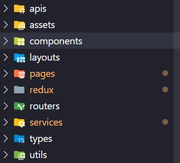

# React + TypeScript + Vite

This template provides a minimal setup to get React working in Vite with HMR and some ESLint rules.

## Project Structure

The project directory is structured as follows:



- **apis**: Contains API service definitions and configuration.
- **assets**: Holds static assets such as images, fonts, etc.
- **components**: Reusable React components.
- **layouts**: Layout components for different sections or pages of the application.
- **pages**: Page components representing different routes/screens in the application.
- **redux**: Redux slices and store configuration.
- **routers**: Route definitions and navigation setup.
- **services**: Other service functions or classes, like utility services.
- **types**: TypeScript type definitions.
- **utils**: Utility functions and helpers.

## Expanding the ESLint configuration

If you are developing a production application, we recommend updating the configuration to enable type aware lint rules:

- Configure the top-level `parserOptions` property like this:

```js
export default {
  // other rules...
  parserOptions: {
    ecmaVersion: "latest",
    sourceType: "module",
    project: ["./tsconfig.json", "./tsconfig.node.json"],
    tsconfigRootDir: __dirname,
  },
};
```
